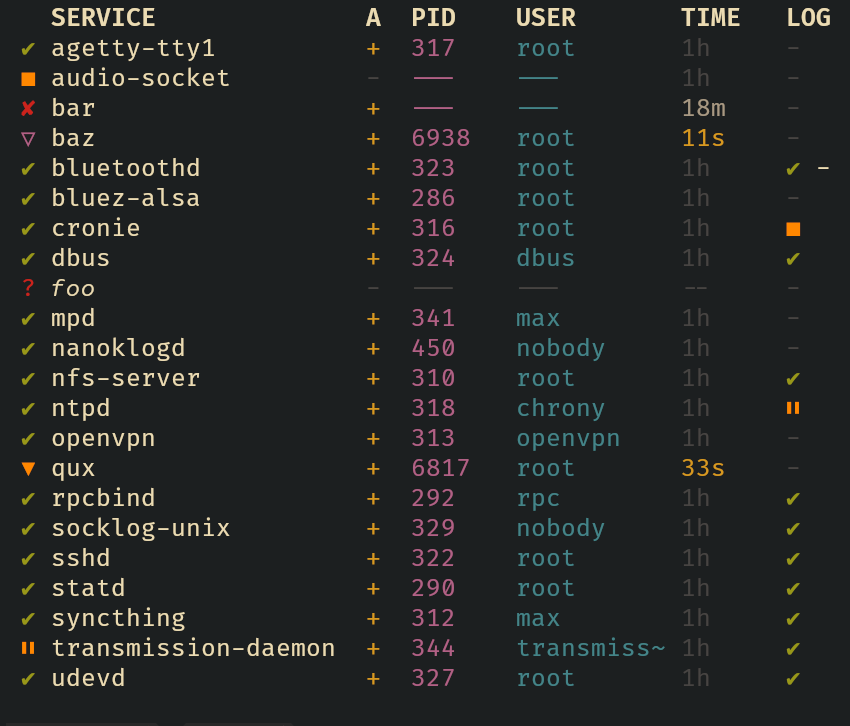

# svs

Check/view status of `runit` services.

## Description

`svs` is not a wrapper for `sv`. It checks the status of `runit`
services directly reading binary data from `supervise/status` of
each service. The output format is inspired by `vsv`.

## Usage

### View

Without options, `svs` will pretty-print the status of all services from
`$SVDIR` or, if not set, `/var/service`. Indicate custom directory with
`-d <dir>`.

The status indicators are:

- `✔` - running normally (*sv*: `run`, no `paused`, no `want down`)
- `✘` - fails (*sv*: `down`, but `want up`)
- `■` - stopped (*sv*: `down`, no `want up`)
- `▽` - finalizing (*sv*: `finish` script running)
- `⏸` - paused (*sv*: `run` or `finish`, but `paused`)
- `▼` - stopping (*sv*: `run` or `finish`, but `want down`)
- `?` - cannot be checked (dangling symlink or no read permission)

The same indicators are used for corresponding logging services (if
present, otherwise `-`).

The `A` column indicates if the service autostarts on boot (`+`,
"enabled") or not (`-`, "disabled"), i.e. if `down` file is absent or
present in the service directory. For log services, no indicator is
shown if log is "enabled", and `-` is shown near the main indicator if
log is "disabled".

Similar to `vsv`, the time elapsed since the last state change is
highlighted differently for <1m, <5m, <1h ago.

### Check

With `-q` option, `svs` will perform quietly in script-friendly mode
and exit with the status code, in this order:

- `1` - if no entries in service directory
- `2` - if at least one service fails
- `3` - if at least one service cannot be checked
- `0` - otherwise (each service is running, paused, stopping, finalizing or stopped)

## Installation

Use `xbps` template: https://github.com/Galicarnax/void-packages/blob/custompack/srcpkgs/svs/template

Or, if you are happy with your package manager being unaware of `svs`: `make` + `sudo make install`.
